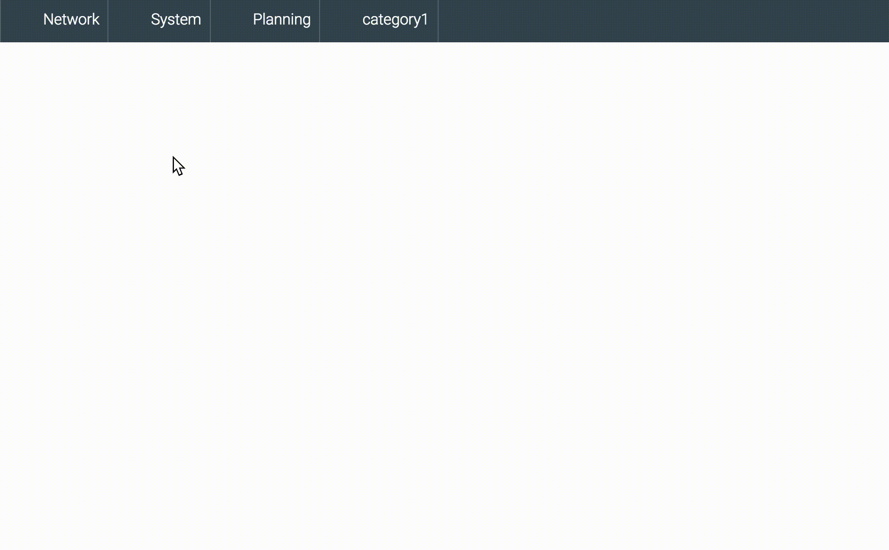

[ci-img]: https://img.shields.io/travis/ciena-frost/ember-frost-navigation.svg "Travis CI Build Status"
[ci-url]: https://travis-ci.org/ciena-frost/ember-frost-navigation.svg?branch=master

[cov-img]: https://img.shields.io/coveralls/ciena-frost/ember-frost-navigation.svg "Coveralls Code Coverage"
[cov-url]: https://coveralls.io/github/ciena-frost/ember-frost-navigation

[npm-img]: https://img.shields.io/npm/v/ember-frost-navigation.svg "NPM Version"
[npm-url]: https://www.npmjs.com/package/ember-frost-navigation

[![Travis][ci-img]][ci-url] [![Coveralls][cov-img]][cov-url] [](https://codeclimate.com/github/ciena-frost/ember-frost-navigation)  [](https://emberobserver.com/addons/ember-frost-navigation) [![NPM][npm-img]][npm-url]

# ember-frost-navigation

Navigation made easy. Makes use of liquid fire and the `RouterDSL` prototype to make a clean and concise way of creating, and navigating routes.

Also supports [ember-engines](https://github.com/dgeb/ember-engines)

 * [Installation](#installation)
 * [API](#api)
 * [Examples](#examples)
 * [Development](#development)

## Installation
```
ember install ember-frost-navigation
```

## Examples



Add the `{{frost-navigation}}` component to the template where you want the navigation to appear, then configure your navigation in `app/router.js`

```js
Router.map(function () {
  this.nav('demo', {
    path: '/'
  }, function () {
    this.category('Category 1', {
      pack: 'dummy',
      icon: 'sample'
    }, function () {
      this.column('Column 1', {
        color: '#009eef'
      }, function () {
        this.app('App 1', {
          route: 'go',
          description: 'Description 1',
          pack: 'dummy',
          icon: 'sample'
        })
        this.engine('Blog Engine', {
          route: 'blog',
          package: 'ember-blog-engine',
          pack: 'dummy',
          icon: 'sample'
        })
        this.section('Section 1', {
          color: '#a1e7ff'
        }, function () {
          this.link('Google', {
            url: 'http://google.ca',
            description: 'Go to Google',
            pack: 'dummy',
            icon: 'sample'
          })
          this.link('http://google.ca')
          this.action('Action 1', {
            action: 'myAction',
            pack: 'dummy',
            icon: 'sample'
          })
        })
      })
      this.column('Column 2')
    })
  })
})
```

## Documentation

### `this.nav`
```js
/**
 * Initializes the navigation bar
 * @parent Ember.RouterDSL
 * @param {string} config.dialogClass class to apply to liquid-modal
 * @param {object} config.actions actions to pass up to liquid-modal
 * @param {array} config.model predefined model to be rendered
 */
```

### `this.category`
```js
/**
 * Category as a navigation bar entry
 * @parent {type:nav}
 * @param {string} config.icon icon
 * @param {string} config.pack icon pack
 * @param {array} config.model predefined category model
 */
```

### `this.column`
```js
/**
 * Creates a column viewable within a category
 * @parent {type:category}
 * @param {string} config.color color
 * @param {array} config.routes predefined routes array
 * @param {array} config.actions predefined actions array
 */
```
### `this.section`
```js
/**
 * Creates a section under within a category
 * @parent {type:category}
 * @param {string} config.color color
 * @param {array} config.routes predefined routes array
 * @param {array} config.actions predefined actions array
 */
```
### `this.app`
```js
/**
 * Creates a routable route instance
 * @parent {type:[column, section]}
 * @param {string} config.description description
 * @param {string} config.icon icon
 * @param {string} config.pack icon pack
 * @param {string} config.route route to navigate to
 */
```
### `this.engine`
```js
/**
 * Creates a routable engine instance
 * @parent {type:[column, section]}
 * @param {string} config.package package name for engine
 * @param {string} config.route route name for nav entry
 * @param {string} config.description description
 * @param {string} config.icon icon
 * @param {string} config.pack icon pack
 */
```
### `this.action`
```js
/**
 * Creates a menu item that serves as an action,
 * without performing a transition
 * @parent {type:[column, section]}
 * @param {string} config.description description
 * @param {string} config.icon icon
 * @param {string} config.pack icon pack
 * @param {string} config.action key for action on controller
 * @param {boolean} config.dismiss flag to dismiss modal after click
 */
```
### `this.link`
```js
/**
 * Creates a link accessible from frost-navigation
 * @parent {type:[column, section]}
 * @param {string} config.description description
 * @param {string} config.icon icon
 * @param {string} config.pack icon pack
 * @param {string} config.route navigate to route without registering on DSL
 * @param {string} config.url url to set href to
 * @param {boolean} config.tabbed flag to open in new tab (default false)
 */
```

## Testing with [ember-hook](https://www.npmjs.com/package/ember-hook)

The navigation component is accessible using ember-hook with the top level hook names, or you can access the internal components as well -

| Property                                     	| Hook                                                                            	|
|----------------------------------------------	|---------------------------------------------------------------------------------	|
| top level hook                               	| `$hook('frost-nav')`                                                            	|
| modal hook                                   	| `$hook('frost-nav-modal')`                                                      	|
| category hook                                	| `$hook('frost-nav-category-<index>')`                                           	|
| section / column hook                        	| `$hook('frost-nav-modal-section-<index>')`                                      	|
| section actions hook`                        	| `$hook('frost-nav-modal-section-actions')`                                      	|
| inline action from section context           	| `$hook('frost-nav-modal-section-<sectionIndex>-action-<actionIndex>')`          	|
| route hook                                   	| `$hook('frost-nav-modal-section-<sectionIndex>-route-<routeIndex>')`            	|
| frost-link within the route / action context 	| `$hook('frost-nav-modal-section-<sectionIndex>-(route / action)-<index>-link')` 	|
| action from section actions context          	| `$hook('frost-nav-modal-section-actions-<index>')`                       	|


## Setup
```
git clone git@github.com:ciena-frost/ember-frost-navigation.git
cd ember-frost-navigation
npm install && bower install
```

## Development Server
A dummy application for development is available under `ember-frost-navigation/tests/dummy`.
To run the server run `ember server` (or `npm start`) from the root of the repository and
visit the app at http://localhost:4200.

### Testing
Run `npm test` from the root of the project to run linting checks as well as execute the test suite
and output code coverage.
